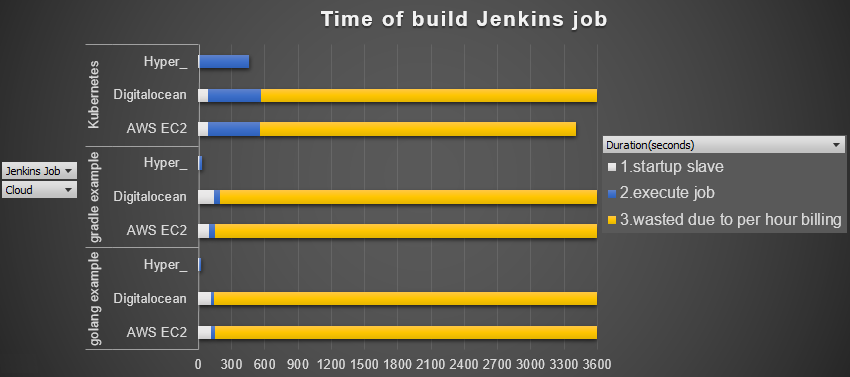

Hyper_ Slaves Plugin vs Digitalocean Plugin vs Amazon EC2 Plugin
===========================================================

This doc compares [hyper-slaves-plugin](http://github.com/jenkinsci/hyper-slaves-plugin) with [digitalocean-plugin](https://github.com/jenkinsci/digitalocean-plugin) and [ec2-plugin](https://github.com/jenkinsci/ec2-plugin) through build several projects in Jenkins.

The test projects are:

| Project | Language | Memory Requirement  | GitHub Statistics |
| --- | --- | --- | --- |
| [kubernetes/kubernetes](https://github.com/kubernetes/kubernetes) | golang | 8GB |  |
| [pkainulainen/gradle-examples](https://github.com/pkainulainen/gradle-examples) | java | 512MB |  |
| [golang/example](https://github.com/golang/example) | golang | 512MB |  |

# Compare Result

 The advantages of Hyper_ are:
- Short startup time: `3~10` seconds
- No cost of the waste: per `second` billing

# Main Difference

|| hyper-slaves-plugin | digitalocean-plugin | ec2-plugin |
| --- | --- | --- | --- |
| Slave Node Type | Hyper_ Container (use Slave like a container) | Droplet (use Slave like a VM) | EC2 Instance (use Slave like a VM) |
| Extension Point | one-shot-executor | Jenkins Cloud API | Jenkins Cloud API |
| Connection Type | via JNLP(TCP) | via SSH (need open port 22) | via SSH (need open port 22) |
| Public IP | Only Jenkins Master need | Each Slave Node need | Each Slave Node need |
| Location | California(Los Angeles) | California(San Francisco) | California(San Jose) |
| Image | use Docker image | use VM(kvm) image | use VM(xen) image |
| Startup duration | < 10 seconds | > 1 minute | > 1 minute |
| Pricing | [By second](https://hyper.sh/pricing) | [By hour](https://www.digitalocean.com/pricing) | [By hour](http://www.ec2instances.info/?region=us-west-1) |

# Detailed test data

## 1) [golang] : kubernetes/kubernetes

| | hyper-slaves-plugin | digitalocean-plugin | ec2-plugin |
| --- | --- | --- | --- |
| Image Name | hyperhq/jenkins-slave-golang:1.7-centos | (Snapshot)centos7.2-java-golang-python-php | (AMI)amazon-linux-java-go-python-php |
| Container size | (L2) Mem: 8GB vCPU: 4 (MemTotal:8370992 kB) (Intel(R) Xeon(R) CPU E5-2630 v4 @ 2.20GHz) | ($80 /mo) Mem: 8GB vCPU: 4 (MemTotal:8010932 kB) (Intel(R) Xeon(R) CPU E5-2630 0 @ 2.30GHz) | (T2 Large) Mem: 8GB vCPU: 2 (MemTotal:8178628 kB) (Intel(R) Xeon(R) CPU E5-2676 v3 @ 2.40GHz) |
| Price | $0.00006 /second ($0.216 /hour) | $0.119 /hour | $0.136 /hour |
| Slave Node startup duration | 7 seconds | 88 seconds | 87 seconds |
| Job execution duration | 453 sec | 475 sec | 468 sec |
| Total time | 460 seconds | 563 seconds | 555 seconds |
| Total cost | $ 0.0276 (460 seconds) | $ 0.119 (1 hour) | $ 0.136 (1 hour) |

## 2) [java] : pkainulainen/gradle-examples

| | hyper-slaves-plugin | digitalocean-plugin | ec2-plugin |
| --- | --- | --- | --- |
| Image Name | hyperhq/jenkins-slave-gradle | (Snapshot)centos7.2-java-golang-python-php | (AMI)amazon-linux-java-go-python-php |
| Container size | (S4) Mem: 512MB vCPU: 1 (MemTotal:506672 kB) (Intel(R) Xeon(R) CPU E5-2630 v4 @ 2.20GHz) | ($80 /mo) Mem: 512MB vCPU: 1 (MemTotal:503260 kB) (Intel(R) Xeon(R) CPU E5-2676 v3 @ 2.40GHz) | (T2 Nano) Mem: 512MB vCPU: 1 (MemTotal:500824 kB) (Intel(R) Xeon(R) CPU E5-2620 0 @ 2.00GHz) |
| Price | $0.000002 /second ($0.0072 /hour) | $ 0.007 /hour | $ $0.009 /hour |
| Slave Node startup duration | 3 seconds | 142 seconds | 97 seconds |
| Job execution duration | 29 sec | 57 sec | 52 sec |
| Total time | 32 seconds | 199 seconds | 149 seconds |
| Total cost | $ 0.000064 ( 32 seconds) | $ 0.007 (1 hour) | $ 0.009 (1 hour) |

## 3) [golang] : golang/example

| | hyper-slaves-plugin | digitalocean-plugin | ec2-plugin |
| --- | --- | --- | --- |
| Image Name | hyperhq/jenkins-slave-gradle | (Snapshot)centos7.2-java-golang-python-php | (AMI)amazon-linux-java-go-python-php |
| Container size | (S4) Mem: 512MB vCPU: 1 (MemTotal:506672 kB) (Intel(R) Xeon(R) CPU E5-2630 v4 @ 2.20GHz) | ($80 /mo) Mem: 512MB vCPU: 1 (MemTotal:500824 kB) (Intel(R) Xeon(R) CPU E5-2630 0 @ 2.30GHz) | (T2 Nano) Mem: 512MB vCPU: 1 (MemTotal:503260 kB) (Intel(R) Xeon(R) CPU E5-2676 v3 @ 2.40GHz) |
| Price | $0.000002 /second ($0.0072 /hour) | $ 0.007 /hour | $ $0.009 /hour |
| Slave Node startup duration | 7 seconds | 117 seconds | 111 seconds |
| Job execution duration | 15 sec | 20 sec | 36 sec |
| Total time | 22 seconds | 137 seconds | 147 seconds |
| Total cost | $ 0.000044 ( 22 seconds) | $ 0.007 (1 hour) | $ 0.009 (1 hour) |

> Note:  
- In this case, the size of Hyper_ container also can be `S3`(Mem: 256MB)  
- The minimum Memory size is 512MB in Digitalocean and AWS EC2  
- The minimum Memory size for run Slave node in Hyper_ container is `S2`(Mem: 128MB)
