Build GitHub Pull Request in Hyper.sh Container with Jenkins
============================================================

<!-- TOC depthFrom:1 depthTo:6 withLinks:1 updateOnSave:1 orderedList:0 -->

- [1.Summary](#1summary)
	- [1.1 Prerequisite](#11-prerequisite)
	- [1.2 GitHub Repo](#12-github-repo)
	- [1.3 Workflow](#13-workflow)
- [2.Run Jenkins Server](#2run-jenkins-server)
- [3. Access Jenkins Web UI](#3-access-jenkins-web-ui)
- [4.Config Jenkins](#4config-jenkins)
	- [4.1 Config hyper-slaves-plugin](#41-config-hyper-slaves-plugin)
	- [4.2 Config GitHub Pull Request Builder Plugin](#42-config-github-pull-request-builder-plugin)
		- [4.2.1 Create API Token](#421-create-api-token)
		- [4.2.2 Config other options](#422-config-other-options)
- [5.Config Job](#5config-job)
	- [5.1 General](#51-general)
	- [5.2 Source Code Management](#52-source-code-management)
	- [5.3 Build Triggers](#53-build-triggers)
	- [5.4 Build Step](#54-build-step)
		- [Build script](#build-script)
	- [5.5 Post-build Actions](#55-post-build-actions)
	- [5.6 Save Job](#56-save-job)
- [6. Trigger Build by GitHub Webhook](#6-trigger-build-by-github-webhook)
- [7. Build Result](#7-build-result)
	- [7.1 Jenkins Log](#71-jenkins-log)
		- [Build History](#build-history)
		- [Build Status](#build-status)
		- [Console Output](#console-output)
	- [7.2 GitHub status](#72-github-status)
		- [1) Set build status to "pending" on GitHub commit](#1-set-build-status-to-pending-on-github-commit)
		- [2) Set build status on GitHub commit](#2-set-build-status-on-github-commit)
		- [3) Build status on each commit](#3-build-status-on-each-commit)
- [8 Problem](#8-problem)
	- [8.1 Doesn’t support build in parallel](#81-doesnt-support-build-in-parallel)
- [FAQ](#faq)
	- [1. Launch container timeout](#1-launch-container-timeout)

<!-- /TOC -->

# 1.Summary

## 1.1 Prerequisite

- GitHub Account
- [Hyper.sh Credential](https://docs.hyper.sh/GettingStarted/generate_api_credential.html)
- Hyper client
    - Installed on localhost (it’s used to run Jenkins Server in Hyper.sh Cloud)
- Docker image
    - [hyperhq/hykins](https://hub.docker.com/r/hyperhq/hykins/) (pre-built Jenkins server image)
        - [hyper client](https://docs.hyper.sh/GettingStarted/install.html)
        - [GitHub Pull Request Builder Plugin](https://wiki.jenkins-ci.org/display/JENKINS/GitHub+pull+request+builder+plugin)
        - [Hyper.sh Slaves Plugin](https://wiki.jenkins-ci.org/display/JENKINS/Hyper_+Slaves+Plugin)
        - Other Recommended Plugin(git, ssh-slaves, credentials-binding, gradle,...)

## 1.2 GitHub Repo

- Main repo(build PR)
  - [https://github.com/Jimmy-Xu/example](https://github.com/Jimmy-Xu/example)
- Cloned repo(create PR)
  - [https://github.com/cocobjcn/example](https://github.com/cocobjcn/example)

## 1.3 Workflow

- Commit the change to cloned repo.
- Create PR via cloned repo.
- Jenkins job(for Main Repo) will be triggered via GitHub Webhook.
- Jenkins build PR automatically.
- Jenkins will set build status of PR on GitHub.

# 2.Run Jenkins Server

```bash
//start Jenkins Server container
$ hyper run --name jenkins-server \
  -d -P \
  -v jenkins-data:/var/jenkins_home \
  hyperhq/hykins

//add public ip to container
$ FIP=$(hyper fip allocate 1)
$ hyper fip attach $FIP jenkins-server
```


# 3. Access Jenkins Web UI

Open `http://$FIP:8080` in Web Browser.

The default admin account is `admin`/`nimda`.

If you want to customize the admin account, please see [this](../../server#customized-jenkins-admin-account)

# 4.Config Jenkins

## 4.1 Config hyper-slaves-plugin

```
(Menu) Manage Jenkins ->  Configure System -> Hyper.sh Config
  -> Input "Hyper.sh Access Key" and "Hyper.sh Secret Key"
  -> Click "Save Credentials" button
  -> Click "Test connection to Hyper.sh" button
```


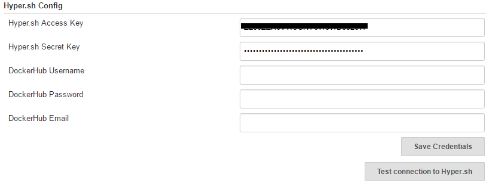

## 4.2 Config GitHub Pull Request Builder Plugin

### 4.2.1 Create API Token

```
(Menu) Manage Jenkins ->  Configure System -> GitHub Pull Request Builder
  -> Click "Create API Token" button
  -> Input "Username temp" and "Password temp"  (GitHub account to create token)
  -> Click "Create Token" button

-> Click global "Save" button of "Config System"
```


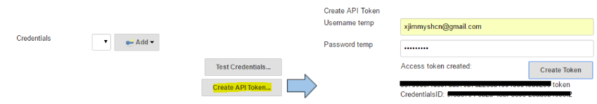

Goto [https://github.com/settings/tokens](https://github.com/settings/tokens).

A personal access token named `Jenkins GitHub Pull Request Builder` will be created in GitHub.

>This token is used to create GitHub Webhook and update status of each PR on GitHub


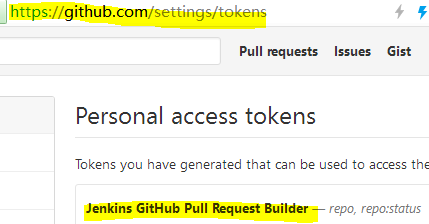

### 4.2.2 Config other options

```
(Menu) Manage Jenkins ->  Configure System -> GitHub Pull Request Builder
  -> Shared secret  : Secret of GitHub Webhook.
  -> Credentials    : Select GitHub auto generated token credentials.
```


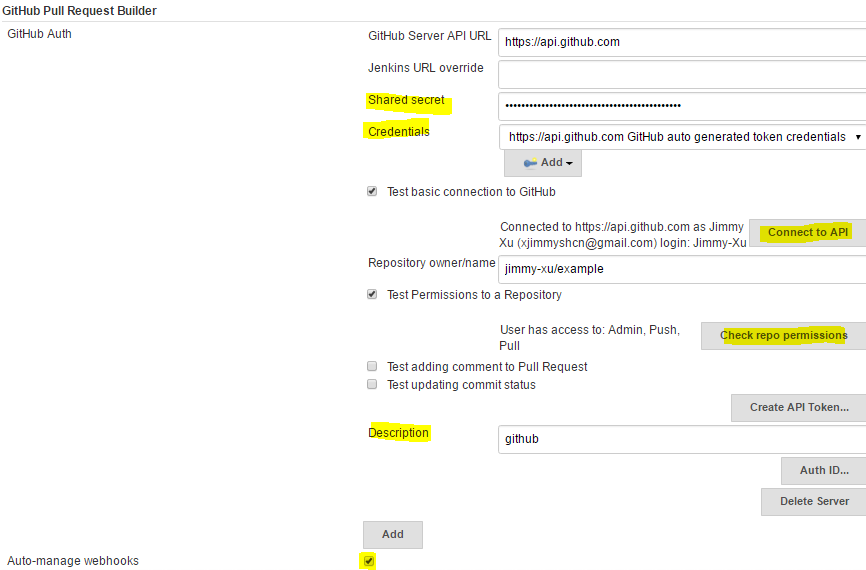

# 5.Config Job

Create a job of `Freestyle project`.

## 5.1 General

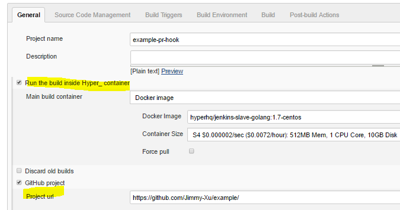

- Check `Run the build inside Hyper.sh container`
    - **Docker Image**
        - hyperhq/jenkins-slave-golang:1.7-centos ([Dockerfile](../../slave/jenkins-slave-centos/Dockerfile))
- GitHub project
    - **Project URL**
        - [https://github.com/Jimmy-Xu/example](https://github.com/Jimmy-Xu/example)

## 5.2 Source Code Management

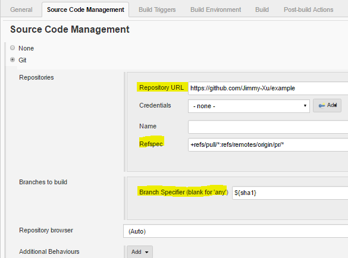

**Repository URL**: `https://github.com/Jimmy-Xu/example`

**Refspec**：`+refs/pull/*:refs/remotes/origin/pr/*`

**Branch Specifer**：`${sha1}`

>[Optional]  
>To build PR manually  
>1) just add a "String Parameter" like this：  
>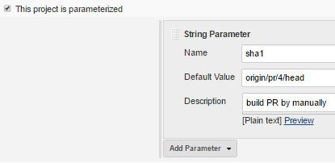

>2) disable "Use github hooks for build triggering"  
>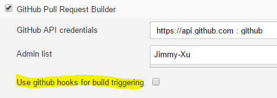

## 5.3 Build Triggers

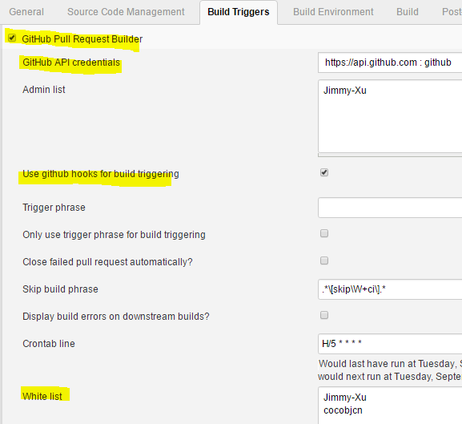

- **GitHub API credentials**
  - Be Configured in Jenkins global config
- **Use GitHub Webhook for build triggering**
  - Trigger Build via GitHub Webhook
  - This option will disable cron-based polling
- **Whitelist**
  - People who submit pull requests can have their pull requests automatically build.
  - If you don’t add people to the white list you will need to tell Jenkins to build the PR.

## 5.4 Build Step

Add two build step:

- Set build status to `pending` on GitHub commit
- Execute shell

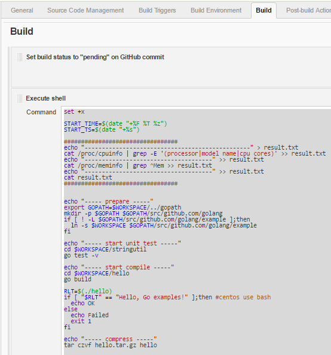

### Build script

```bash
  set +x

  START_TIME=$(date "+%F %T %z")
  START_TS=$(date "+%s")

  #################################
  echo "------------------------------------------------" > result.txt
  cat /proc/cpuinfo | grep -E '(processor|model name|cpu cores)' >> result.txt
  echo "-------------------------------------" >> result.txt
  cat /proc/meminfo | grep ^Mem >> result.txt
  echo "-------------------------------------" >> result.txt
  cat result.txt
  #################################


  echo "----- prepare -----"
  export GOPATH=$WORKSPACE/../gopath
  mkdir -p $GOPATH $GOPATH/src/github.com/golang
  if [ ! -L $GOPATH/src/github.com/golang/example ];then
    ln -s $WORKSPACE $GOPATH/src/github.com/golang/example
  fi

  echo "----- start unit test -----"
  cd $WORKSPACE/stringutil
  go test -v

  echo "----- start compile -----"
  cd $WORKSPACE/hello
  go build

  RLT=$(./hello)
  if [ "$RLT" == "Hello, Go examples!" ];then #centos use bash
    echo OK
  else
    echo Failed
    exit 1
  fi

  echo "----- compress -----"
  tar czvf hello.tar.gz hello

  #################################
  END_TIME=$(date "+%F %T %z")
  END_TS=$(date "+%s")
  echo "--------------------------------"
  echo "Step Start Time:${START_TIME}"
  echo "Step End Time:${END_TIME}"
  echo "Step duration: $((END_TS-START_TS))"
```


## 5.5 Post-build Actions

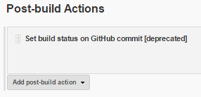

## 5.6 Save Job

After the above Jenkins Job was saved, a `GitHub Webhook` will be created automatically.

([https://github.com/Jimmy-Xu/example/settings/hooks](https://github.com/Jimmy-Xu/example/settings/hooks))

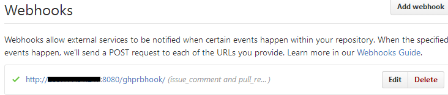

# 6. Trigger Build by GitHub Webhook

To build PR by GitHub Webhook:

1. Commit the change to cloned repo [https://github.com/cocobjcn/example](https://github.com/cocobjcn/example) .
2. Create Pull Request in cloned repo.
Then, Jenkins Job build will be triggered via GitHub Webhook automatically.

**Note**: For test purpose, you just need to create one Pull Request. You can Close and Re-Open the PR, then a new job build will be triggered again.

# 7. Build Result

## 7.1 Jenkins Log

### Build History
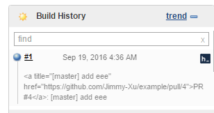

### Build Status


### Console Output
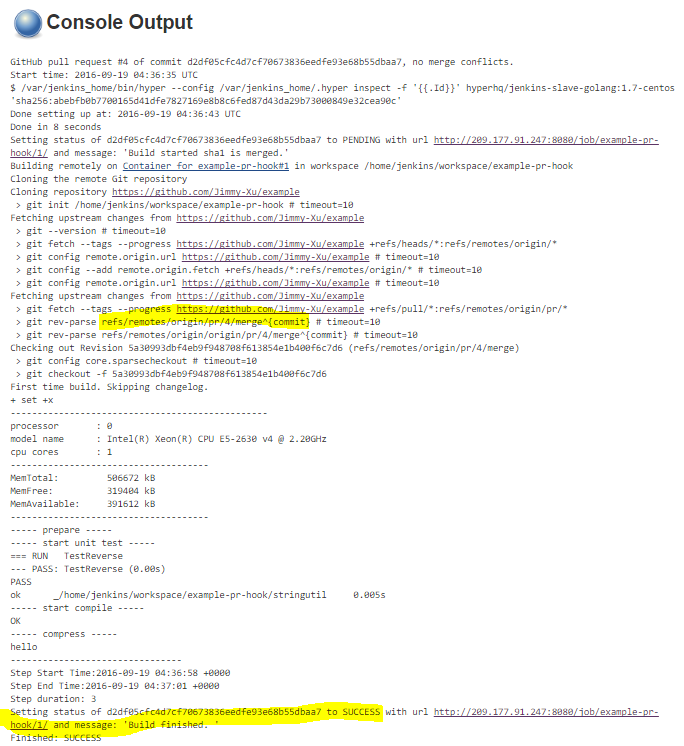

## 7.2 GitHub status

Jenkins will set build status of PR on GitHub.

### 1) Set build status to "pending" on GitHub commit
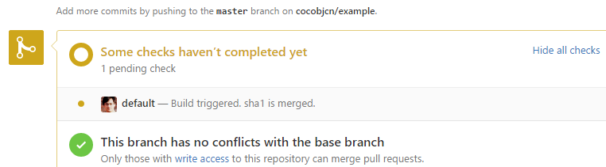

### 2) Set build status on GitHub commit

Click the Details link will jump to Jenkins build history.

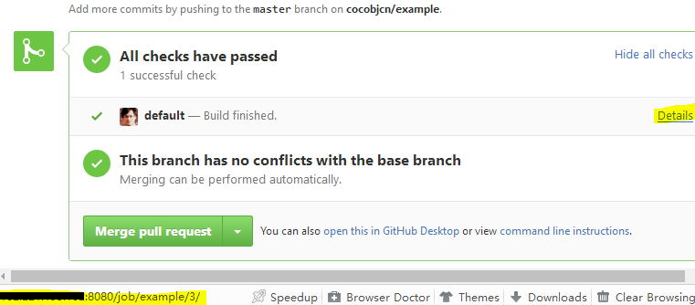

### 3) Build status on each commit

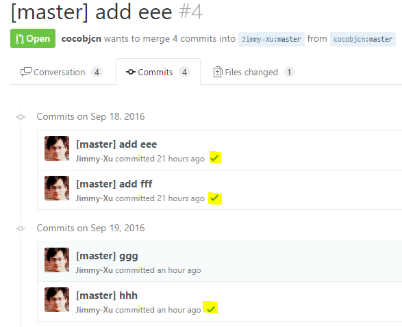

# 8 Problem

## 8.1 Doesn’t support build in parallel

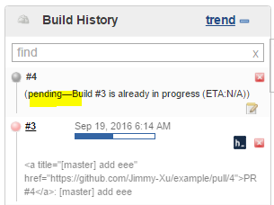


# FAQ

## 1. Launch container timeout

This will occur when use EIP as Jenkins URL.   
To solve this issue, Please use internal ip(default) as "Jenkins URL".  
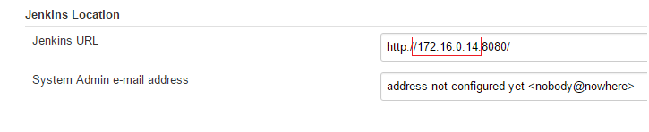

And use EIP in "Jenkins URL override" of "GitHub Pull Request Builder"
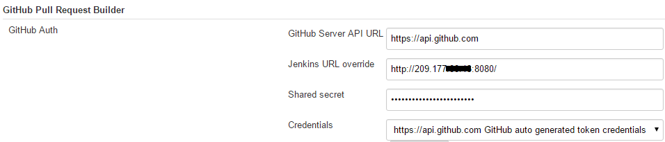
