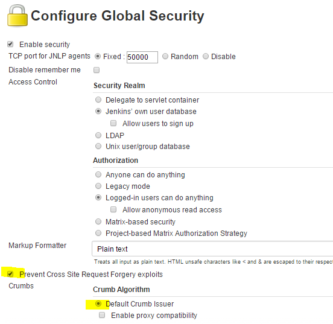
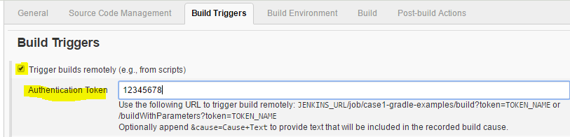
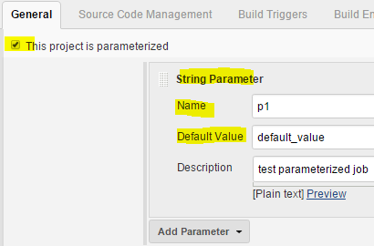
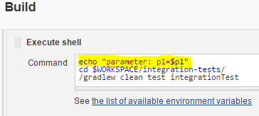

Trigger Jenkins Job build via Jenkins Remote Access API
=======================================================

REF: https://wiki.jenkins-ci.org/display/JENKINS/Remote+access+API

<!-- TOC depthFrom:1 depthTo:6 withLinks:1 updateOnSave:1 orderedList:0 -->

- [Global config for security](#global-config-for-security)
- [Get CRUMB](#get-crumb)
- [Jobs without parameters](#jobs-without-parameters)
	- [Job config](#job-config)
	- [Call jenkins remote api to trigger build](#call-jenkins-remote-api-to-trigger-build)
- [Jobs with parameters](#jobs-with-parameters)
	- [Job config with parameter](#job-config-with-parameter)
	- [Call jenkins remote api to trigger build with parameter](#call-jenkins-remote-api-to-trigger-build-with-parameter)

<!-- /TOC -->

# Global config for security


# Get CRUMB
```bash
USER=admin
PASSWD=admin
TOKEN=12345678
IP=x.x.x.x
JENKINS_URL="http://$USER:$PASSWD@$IP:8080"
JOB_NAME="case1-gradle-examples"

$ curl -s --user $USER:$PASSWD http://$IP:8080/crumbIssuer/api/json
{"_class":"hudson.security.csrf.DefaultCrumbIssuer","crumb":"58e45f5135ae87a5fb9043e7b46xxxxx","crumbRequestField":"Jenkins-Crumb"}

$ CRUMB=$(curl -s "http://$USER:$PASSWD@$IP"':8080/crumbIssuer/api/xml?xpath=concat(//crumbRequestField,":",//crumb)')
or
$ CRUMB=$(curl -s --user $USER:$PASSWD $JENKINS_URL'/crumbIssuer/api/xml?xpath=concat(//crumbRequestField,":",//crumb)')

$ echo $CRUMB
Jenkins-Crumb:58e45f5135ae87a5fb9043e7b46xxxxx
```

# Jobs without parameters

## Job config




## Call jenkins remote api to trigger build
```bash
$ curl -X POST -H $CRUMB $JENKINS_URL/job/${JOB_NAME}/build?token=$TOKEN
```

# Jobs with parameters

## Job config with parameter






## Call jenkins remote api to trigger build with parameter
```bash
$ curl -X POST -H $CRUMB $JENKINS_URL/job/${JOB_NAME}/build?token=$TOKEN \
--data-urlencode json='{"parameter": [{"name":"p1", "value":"test"}]}'
```
